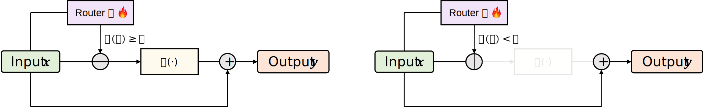
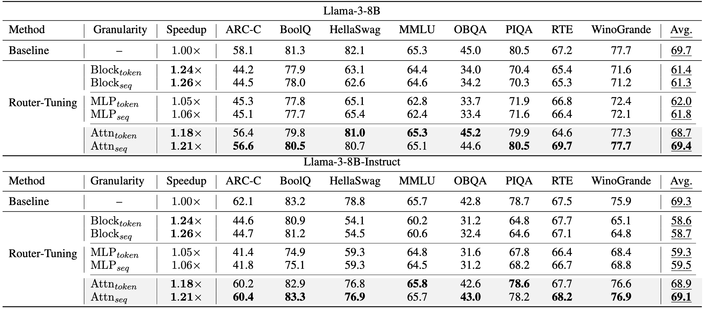
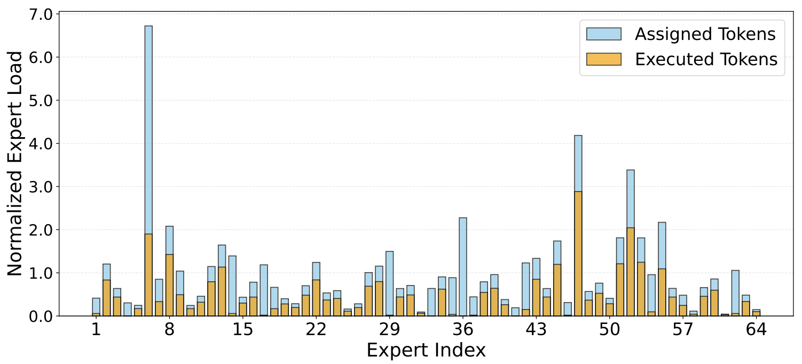
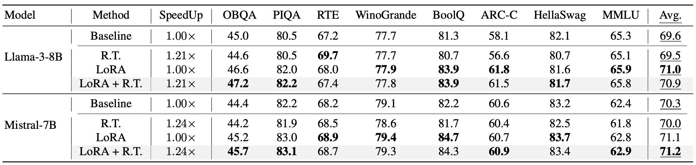

<h1 align="center">[EMNLP 2025] Router-Tuning: A Simple and Effective Approach for Enabling Dynamic-Depth in Transformers</h1>


<p align="center">
  <a href="https://arxiv.org/abs/2410.13184"></a>
  <a href="https://aclanthology.org/2025.emnlp-main.99"></a>
  
</p>

<p align="center">
  <a href="https://shwai-he.github.io/">Shwai He</a>, <a href="https://getao.github.io/">Tao Ge</a>, <a href="https://s1gh.alphaxiv.io/">Guoheng Sun</a>, <a href="https://bowei.netlify.app/#about">Bowei Tian</a>, <a href="https://xyang0.github.io/">Xiaoyang Wang</a>, <a href="https://sites.google.com/view/dongyu888/">Dong Yu</a>
</p>

<p align="center">
  <a href="#-introduction">📖 Introduction</a> •
  <a href="#-news">📰 News</a> •
  <a href="#-why-this-repo">✨ Why</a> •
  <a href="#-results">📈 Results</a> •
  <a href="#-quick-start">🚀 Quick Start</a> •
  <a href="#-citation">📄 Citation</a>
</p>


## 📖 Introduction

This is the official implementation of the paper [**Router-Tuning: A Simple and Effective Approach for Enabling Dynamic-Depth in Transformers**](https://arxiv.org/abs/2410.13184), accepted at **EMNLP 2025**. We provide a practical framework for efficient dynamic-depth training and inference in Transformers.

Router-Tuning enables dynamic-depth inference by fine-tuning only router-related parameters. Compared with standard full-model dynamic-depth tuning, it significantly reduces training cost while keeping model quality competitive.

<p align="center">
  
</p>

## 📰 News
- Aug 2025: Router-Tuning accepted to **EMNLP 2025** main conference.
- Oct 2024: arXiv preprint and code release.

## ✨ Why This Repo
Traditional transformers execute a fixed number of layers for every token, which wastes computation on easy tokens.

[Mixture of Depths (MoD)](https://arxiv.org/abs/2404.02258) addresses this by dynamically skipping less important computations, but two practical issues remain:

1. Existing methods usually tune the whole model, causing high training cost.
2. Aggressive skipping can hurt quality if routing is not well calibrated.

Router-Tuning tackles both by focusing optimization on routing components and introducing routing strategies that better preserve performance-efficiency tradeoffs.

## 📈 Results

### 🏁 Main Results
<p align="center">
  
</p>
Router-Tuning consistently improves the efficiency-quality tradeoff over full-parameter dynamic-depth tuning baselines.
The reported best setting reaches notable speedup while keeping quality degradation small.

### 🔬 Expert Routing Analysis
<p align="center">
  
</p>
Router specialization becomes clearer after tuning: the model learns more stable token-to-layer routing patterns.
This supports dynamic-depth execution with lower unnecessary computation.

### 🔗 LoRA Compatibility
<p align="center">
  
</p>
Router-Tuning is compatible with LoRA-based adaptation and can be composed for a better efficiency-performance balance.
In practice, this enables lightweight deployment recipes without full-model retraining.

## 🔍 Core Methods
1. **Router-Only Fine-Tuning**
- Tune router-related parameters instead of full-model updates.
- Strongly reduces optimization cost for dynamic-depth adaptation.

2. **Attention-Based Dynamic Depth**
- Uses attention-based routing granularity to improve compute and memory efficiency.
- Preserves output quality under dynamic-depth execution.

## 📦 Repository Layout
- `entrypoints/finetune/finetune_router_tuning.py`: main training entrypoint.
- `scripts/finetune_router_tuning.sh`: reproducible launcher with `accelerate` + DeepSpeed.
- `entrypoints/data/reformat_datasets.py`: convert raw datasets to unified `messages` format.
- `entrypoints/data/mix_datasets.py`: build mixed instruction-tuning data.
- `utils/pipeline/customized_trainer.py`: router-focused trainer logic.
- `configs/accelerate/`: distributed training launcher configs.
- `configs/deepspeed/`: DeepSpeed runtime configs.

## ⚙️ Installation
```bash
conda create -n router-tuning python=3.10 -y
conda activate router-tuning

git clone https://github.com/CASE-Lab-UMD/Router-Tuning-Mixture-of-Depths.git
cd Router-Tuning-Mixture-of-Depths

pip install -r requirements.txt
```

## 🚀 Quick Start
### 1) 🧹 Prepare Data
Put raw datasets under `data/raw/` using the expected subdirectory names:
- `vicuna_sharegpt`
- `evol_instruct`
- `slim_orca`
- `meta_math_qa`
- `evol_code_alpaca`
- `alpaca`

Then run:

```bash
python entrypoints/data/reformat_datasets.py \
  --raw_data_root ./data/raw \
  --save_path ./data/reformatted

python entrypoints/data/mix_datasets.py \
  --reformatted_dir ./data/reformatted \
  --save_path ./data/mixed
```

### 2) 🏃 Run Router-Tuning
```bash
bash scripts/finetune_router_tuning.sh
```

The training entrypoint is now Hugging Face first:
- Preferred: pass a Hugging Face model ID such as `Qwen/Qwen2.5-7B`.
- Also supported: a normal local model directory.

### 3) 🖥️ Minimal Single-Node Override Example
```bash
NUM_PROCESSES=4 PORT=29501 bash scripts/finetune_router_tuning.sh
```

### 4) ☁️ Hugging Face Example
```bash
MODEL_NAME_OR_PATH="Qwen/Qwen2.5-7B" \
RUN_NAME="qwen2.5-7b" \
NUM_PROCESSES=4 PORT=29501 \
bash scripts/finetune_router_tuning.sh
```

### 5) 🌐 Project Webpage
An embeddable project page draft lives at `docs/index.html`. It is ready to publish with GitHub Pages or any static host.

## 🎛️ Training Knobs
`finetune_router_tuning.sh` is the recommended launcher. Commonly adjusted fields:

- `model_name_or_path`: preferred Hugging Face model ID, or a normal local model path.
- `run_name`: optional output folder alias; defaults to `basename(model_name_or_path)`.
- `trust_remote_code`: defaults to `False`; enable only for architectures that require it.
- `data_type`: one dataset under `data/reformatted/` or `mixed`.
- `max_train_samples`: training subset size for quick experiments.
- `router_layers`: number of deep layers enabled for router tuning in the current implementation.
- `target_capacity`: optional target activation ratio for router regularization.
- `granularity`: routing granularity (`attn_sequence`, `attn_token`, `mlp_sequence`, `mlp_token`, `block_sequence`, `block_token`).
- `router_only`: enable router-only training (default `True`).
- `learning_rate`, `weight_decay`, `num_epochs`.

Distributed launch overrides:
- `NUM_PROCESSES`: number of GPU processes.
- `PORT`: distributed master port.

## 🧪 Evaluation
Evaluation is compatible with [EleutherAI/lm-evaluation-harness](https://github.com/EleutherAI/lm-evaluation-harness).
For strict reproduction used in earlier experiments, see [s1ghhh/lm-evaluation-harness](https://github.com/s1ghhh/lm-evaluation-harness).

## ✅ Repro Checklist
- Python 3.10 environment with `pip install -r requirements.txt`.
- Valid `model_name_or_path`: preferably a Hugging Face model ID or a normal local model path.
- Reformatted/mixed data exists at `data/reformatted/*/data.jsonl` or `data/mixed/data.jsonl`.
- `accelerate` config selected in `scripts/finetune_router_tuning.sh` matches your hardware.
- `NUM_PROCESSES` and GPU memory are consistent with `max_seq_length` and batch setup.

## 📄 Citation
```bibtex
@misc{he2024routertuningsimpleeffectiveapproach,
  title={Router-Tuning: A Simple and Effective Approach for Enabling Dynamic-Depth in Transformers},
  author={Shwai He and Tao Ge and Guoheng Sun and Bowei Tian and Xiaoyang Wang and Dong Yu},
  year={2024},
  eprint={2410.13184},
  archivePrefix={arXiv},
  primaryClass={cs.CL},
  url={https://arxiv.org/abs/2410.13184}
}
```

## 📬 Contact
- Shwai He: `shwaihe@umd.edu`
