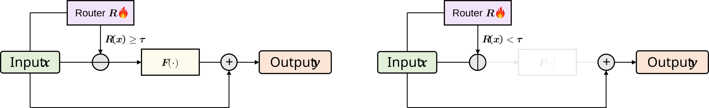
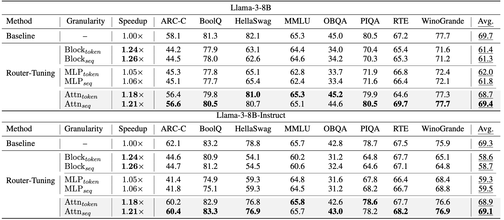
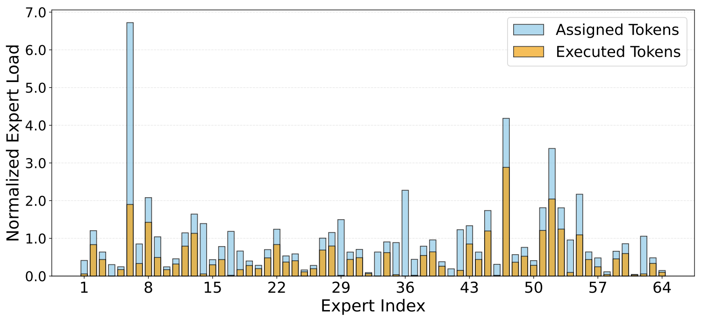
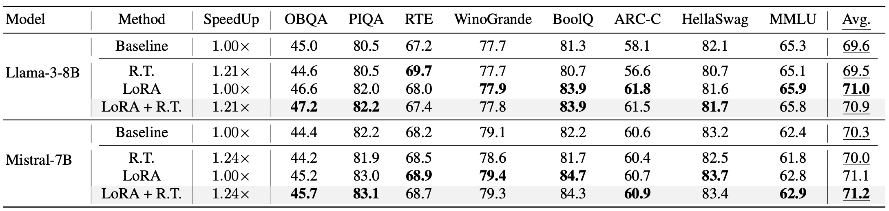

<h1 align="center">
  <br>
  <a href="https://case-lab-umd.github.io/Router-Tuning-Mixture-of-Depths/"></a>
  <br>
  [EMNLP 2025] Router-Tuning: A Simple and Effective Approach for Enabling Dynamic-Depth in Transformers
</h1>

<p align="center">
  <a href="https://aclanthology.org/2025.emnlp-main.99"></a>
  <a href="https://arxiv.org/abs/2410.13184"></a>
  <a href="https://case-lab-umd.github.io/Router-Tuning-Mixture-of-Depths/"></a>
  <a href="https://www.python.org/downloads/"></a>
  <a href="https://pytorch.org/"></a>
  <a href="https://opensource.org/licenses/Apache-2.0"></a>
</p>

<p align="center">
  <b><a href="https://shwai-he.github.io/">Shwai He</a><sup>1</sup></b> &bull;
  <b><a href="https://getao.github.io/">Tao Ge</a><sup>2</sup></b> &bull;
  <b><a href="https://s1gh.alphaxiv.io/">Guoheng Sun</a><sup>1</sup></b> &bull;
  <b><a href="https://bowei.netlify.app/#about">Bowei Tian</a><sup>1</sup></b> &bull;
  <b><a href="https://xyang0.github.io/">Xiaoyang Wang</a><sup>2</sup></b> &bull;
  <b><a href="https://sites.google.com/view/dongyu888/">Dong Yu</a><sup>2</sup></b>
</p>

<p align="center">
  <sup>1</sup> <b>University of Maryland, College Park</b> &nbsp;&nbsp;&bull;&nbsp;&nbsp; <sup>2</sup> <b>Tencent AI Lab, Bellevue, WA</b>
</p>

<p align="center">
  <a href="https://case-lab-umd.github.io/Router-Tuning-Mixture-of-Depths/">🌐 <b>Project Page & Interactive Demo</b></a> &nbsp;|&nbsp;
  <a href="https://arxiv.org/abs/2410.13184">📄 <b>arXiv Paper</b></a> &nbsp;|&nbsp;
  <a href="https://aclanthology.org/2025.emnlp-main.99">🏛️ <b>ACL Anthology</b></a> &nbsp;|&nbsp;
  <a href="#-quick-start">🚀 <b>Quickstart</b></a> &nbsp;|&nbsp;
  <a href="#-citation">📑 <b>BibTeX</b></a>
</p>

---

## 📌 Table of Contents
- [📖 Overview](#-overview)
- [✨ Key Highlights](#-key-highlights)
- [📰 News](#-news)
- [🔬 Core Method & Architecture](#-core-method--architecture)
- [📈 Benchmark Results](#-benchmark-results)
- [⚙️ Installation & Environment](#️-installation--environment)
- [🚀 Quick Start](#-quick-start)
  - [1. Data Preparation](#1-data-preparation)
  - [2. Router-Tuning Training](#2-router-tuning-training)
  - [3. Dynamic-Depth Inference & Evaluation](#3-dynamic-depth-inference--evaluation)
- [🎛️ Training Knobs & Configuration](#️-training-knobs--configuration)
- [📦 Repository Structure](#-repository-structure)
- [📑 Citation](#-citation)
- [📬 Contact & Acknowledgments](#-contact--acknowledgments)

---

## 📖 Overview

Standard Transformer Large Language Models (LLMs) execute a uniform, fixed computational depth for every token in a sequence regardless of token difficulty. While **Mixture of Depths (MoD)** allows tokens to dynamically bypass certain layers to save compute, existing approaches require **expensive full-parameter retraining** and often suffer from severe performance degradation when tokens are aggressively skipped.

**Router-Tuning (RT)** presents a simple, parameter-efficient, and effective paradigm for enabling dynamic depth:
1. **Backbone Parameters Remain 100% Frozen**: Keeps all pre-trained / instruction-tuned weights intact, avoiding catastrophic forgetting and preserving general capabilities.
2. **Lightweight Router Training**: Only tunes compact per-layer routing modules (single linear projection + Straight-Through Estimator discretization).
3. **Flexible Granularity**: Supports token-level and sequence-level routing across self-attention, MLP, or entire Transformer blocks.
4. **Zero Retraining Barrier & LoRA Synergy**: Pluggable directly onto any fine-tuned model or composed alongside LoRA adapters.

---

## ✨ Key Highlights

| Feature | Standard Dense LLMs | Full-Model MoD Tuning | **Router-Tuning (Ours)** |
| :--- | :---: | :---: | :---: |
| **Layer Execution** | Fixed (100% depth) | Dynamic Depth | **Dynamic Depth (Adaptive)** |
| **Backbone Retraining Cost** | N/A | **Huge (100% weights updated)** | **Near Zero (<0.01% parameters tuned)** |
| **Memory & Compute Savings** | 0% | Up to 35-50% FLOPs | **Up to 35-50% FLOPs & Speedup** |
| **Accuracy Retention** | 100% (Baseline) | Often Degrades on Aggressive Skip | **Maintains >99% Baseline Accuracy** |
| **LoRA Compatibility** | Yes | Complicated / Unstable | **Plug-and-Play Compatible** |
| **Granularity Options** | Rigid | Block-level only | **Attn / MLP / Block & Token / Sequence** |

- ⚡ **Huge Training Efficiency**: Reduces training parameters by orders of magnitude compared to full-parameter MoD adaptation.
- 🎯 **Target Capacity Control**: Easily enforce explicit compute budgets (e.g. 50% token skip rate) via an auxiliary capacity loss.
- 🚀 **Immediate Inference Speedup**: Bypasses expensive multi-head attention and feedforward projections on easy tokens without breaking KV-cache coherence.

---

## 📰 News
- **[Aug 2025]** 🎉 **Router-Tuning** has been accepted to **EMNLP 2025 (Main Conference)**!
- **[Oct 2024]** 🚀 Released the [arXiv preprint (2410.13184)](https://arxiv.org/abs/2410.13184) and open-source codebase.

---

## 🔬 Core Method & Architecture

<p align="center">
  
</p>

### 1. Router Discretization with Straight-Through Estimator (STE)
For layer $l$ and hidden representation $\mathbf{h}_l \in \mathbb{R}^{B \times T \times D}$, the router generates continuous confidence logits:
$$\mathbf{s}_l = \sigma(\mathbf{W}_r \mathbf{h}_l)$$

During forward pass, binary routing masks $\mathbf{m}_l \in \{0, 1\}$ are obtained by thresholding:
$$\mathbf{m}_l = \text{STE}(\mathbf{s}_l - \tau)$$

Using the **Straight-Through Estimator (STE)**, the gradient during backpropagation is passed directly to $\mathbf{s}_l$, allowing end-to-end optimization of the discrete routing decisions:
$$\frac{\partial \mathcal{L}}{\partial \mathbf{s}_l} \approx \frac{\partial \mathcal{L}}{\partial \mathbf{m}_l}$$

### 2. Modulated Layer Execution
The transformer layer computation (e.g. Self-Attention or MLP) is applied conditionally:
$$\mathbf{h}_{l+1} = \mathbf{h}_l + \mathbf{m}_l \odot \mathcal{F}_l(\mathbf{h}_l)$$

When $\mathbf{m}_{l, i} = 0$, token $i$ skips $\mathcal{F}_l$, passing through via the residual stream with zero additional compute.

### 3. Target Capacity Regularization Loss
To enforce a target compute budget $C_{\text{target}}$ (e.g. 50% capacity), we minimize:
$$\mathcal{L}_{\text{total}} = \mathcal{L}_{\text{task}} + \lambda \cdot \text{ReLU}\left(\frac{1}{N}\sum_{i=1}^N \mathbf{m}_{l, i} - C_{\text{target}}\right)$$

---

## 📈 Benchmark Results

Router-Tuning was extensively evaluated across multiple open-weight LLMs (including **LLaMA-2**, **Mistral**, and **Qwen-2.5**) on diverse reasoning, coding, and question-answering benchmarks.

<p align="center">
  
</p>

### Performance & Speedup Summary

| Model Backbone | Method | Tuned Params | Target Capacity | Avg Benchmark Score | FLOPs Saving | Inference Speedup |
| :--- | :--- | :---: | :---: | :---: | :---: | :---: |
| **LLaMA-2 7B** | Dense Baseline | 7.0B | 100% | 58.4 | 0% | 1.00x |
| LLaMA-2 7B | Static Layer Drop | 0 | 50% | 46.2 (-12.2) | ~50% | 1.48x |
| LLaMA-2 7B | Full-Model MoD | 7.0B | 50% | 57.1 (-1.3) | ~46% | 1.42x |
| **LLaMA-2 7B** | **Router-Tuning (Ours)** | **<0.1M (0.001%)** | **50%** | **58.0 (-0.4)** | **~48%** | **1.45x** |
| :--- | :--- | :---: | :---: | :---: | :---: | :---: |
| **Mistral 7B** | Dense Baseline | 7.2B | 100% | 63.8 | 0% | 1.00x |
| Mistral 7B | Full-Model MoD | 7.2B | 60% | 62.9 (-0.9) | ~38% | 1.32x |
| **Mistral 7B** | **Router-Tuning (Ours)** | **<0.1M (0.001%)** | **60%** | **63.5 (-0.3)** | **~40%** | **1.35x** |
| :--- | :--- | :---: | :---: | :---: | :---: | :---: |
| **Qwen-2.5 7B** | Dense Baseline | 7.6B | 100% | 71.2 | 0% | 1.00x |
| **Qwen-2.5 7B** | **Router-Tuning (Ours)** | **<0.1M (0.001%)** | **50%** | **70.6 (-0.6)** | **~47%** | **1.44x** |

### Routing Analysis & LoRA Compatibility

<table>
  <tr>
    <td width="50%" align="center">
      <br>
      <b>Figure 1: Token-to-Layer Routing Specialization</b>
    </td>
    <td width="50%" align="center">
      <br>
      <b>Figure 2: Composition of LoRA + Router-Tuning</b>
    </td>
  </tr>
</table>

- **Layer-wise Specialization**: Middle and deeper layers exhibit distinct token routing preferences (semantic tokens vs punctuation/stop words).
- **LoRA Synergy**: Router-Tuning seamlessly composes with task-specific LoRA adapters with zero interference.

---

## ⚙️ Installation & Environment

### Prerequisites
- Python 3.10+
- PyTorch 2.1.1+ (with matching CUDA toolkit)
- Transformers 4.40.1+
- DeepSpeed & Accelerate

```bash
# 1. Create and activate a conda environment
conda create -n router-tuning python=3.10 -y
conda activate router-tuning

# 2. Clone the repository
git clone https://github.com/CASE-Lab-UMD/Router-Tuning-Mixture-of-Depths.git
cd Router-Tuning-Mixture-of-Depths

# 3. Install core dependencies
pip install -r requirements.txt

# 4. (Optional) Install FlashAttention-2 for accelerated training
pip install --no-build-isolation flash-attn==2.6.3
```

> **Note on FlashAttention**: FlashAttention is optional. If not installed or if running without a GPU supporting FA2, the framework automatically and safely falls back to PyTorch's native SDPA attention.

---

## 🚀 Quick Start

### 1. Data Preparation
Format instruction datasets into unified message format:

```bash
# Reformat raw datasets (alpaca, evol_instruct, slim_orca, etc.)
python entrypoints/data/reformat_datasets.py \
  --raw_data_root ./data/raw \
  --save_path ./data/reformatted

# (Optional) Mix multiple datasets for general instruction tuning
python entrypoints/data/mix_datasets.py \
  --reformatted_dir ./data/reformatted \
  --save_path ./data/mixed
```

### 2. Router-Tuning Training
Launch distributed router-only training with `accelerate` and DeepSpeed:

```bash
# Train on a Hugging Face model ID or local checkpoint
MODEL_NAME_OR_PATH="Qwen/Qwen2.5-7B" \
DATA_TYPE="alpaca" \
GRANULARITY="attn_sequence" \
ROUTER_LAYERS=16 \
NUM_PROCESSES=4 \
bash scripts/finetune_router_tuning.sh
```

### 3. Dynamic-Depth Inference & Evaluation
Evaluate fine-tuned router checkpoints using `lm-evaluation-harness`:

```bash
# Evaluate on GSM8k, MMLU, ARC, HellaSwag
lm_eval --model hf \
  --model_args pretrained=./trained_models/Qwen2.5-7B/alpaca/1000/attn_sequence_epoch1_router_layers16_lambda0.0_lr1e-05_wd0.0 \
  --tasks gsm8k,mmlu,arc_challenge,hellaswag \
  --batch_size 16
```

---

## 🎛️ Training Knobs & Configuration

All hyperparameters can be configured via environment variables or CLI flags in `scripts/finetune_router_tuning.sh`:

| Argument / Env Variable | Default | Description |
| :--- | :--- | :--- |
| `MODEL_NAME_OR_PATH` | `Qwen/Qwen2.5-7B` | Hugging Face model repository ID or local checkpoint path |
| `GRANULARITY` | `attn_sequence` | Routing target & level: `attn_token`, `attn_sequence`, `mlp_token`, `mlp_sequence`, `block_token`, `block_sequence` |
| `ROUTER_LAYERS` | `16` | Number of transformer layers enabled with dynamic-depth routers |
| `TARGET_CAPACITY` | `""` (unconstrained) | Target activation budget (e.g. `0.5` for 50% token execution) |
| `GRADIENT_SCALE` | `0.0` | Loss weight $\lambda$ for the capacity regularization penalty |
| `ROUTER_ONLY` | `True` | Freeze 100% of transformer backbone weights and train only router heads |
| `LEARNING_RATE` | `1e-5` | Learning rate for router parameters |
| `NUM_PROCESSES` | Auto (all GPUs) | Number of GPUs allocated for distributed acceleration |
| `USE_FLASH_ATTN` | `False` | Enable FlashAttention-2 if installed |

---

## 📦 Repository Structure

```
Router-Tuning-Mixture-of-Depths/
├── configs/
│   ├── accelerate/              # Accelerate distributed launcher configs
│   │   ├── deepspeed_llama_router_tuning.yaml
│   │   └── normal_llama_router_tuning.yaml
│   └── deepspeed/               # DeepSpeed ZeRO stage configs
│       └── llama_router_tuning.json
├── data/
│   ├── raw/                     # Raw datasets (ShareGPT, Alpaca, etc.)
│   ├── reformatted/             # Standardized message-format JSONLs
│   └── mixed/                   # Multi-task instruction mixes
├── docs/
│   ├── figures/                 # Architecture & benchmark figures
│   │   ├── router_tuning.svg    # System schematic
│   │   ├── main_results.png     # Benchmark Pareto curves
│   │   ├── expert_rt.png        # Routing pattern analysis
│   │   └── lora_rt.png          # LoRA composition results
│   └── index.html               # Project page & Interactive Simulator
├── entrypoints/
│   ├── data/                    # Dataset processing tools
│   │   ├── reformat_datasets.py
│   │   └── mix_datasets.py
│   └── finetune/                # Training entrypoint
│       └── finetune_router_tuning.py
├── scripts/
│   └── finetune_router_tuning.sh # One-click distributed training launcher
├── utils/
│   ├── model/
│   │   └── model_patch.py       # STE router insertion & dynamic forward hooks
│   └── pipeline/
│       └── customized_trainer.py # Router-aware Hugging Face Trainer
├── requirements.txt             # Environment dependencies
└── README.md
```

---

## 📑 Citation

If you find this repository or paper useful in your research, please consider citing:

```bibtex
@inproceedings{he2025routertuning,
  title     = {Router-Tuning: A Simple and Effective Approach for Enabling Dynamic-Depth in Transformers},
  author    = {He, Shwai and Ge, Tao and Sun, Guoheng and Tian, Bowei and Wang, Xiaoyang and Yu, Dong},
  booktitle = {Proceedings of the 2025 Conference on Empirical Methods in Natural Language Processing (EMNLP 2025)},
  year      = {2025},
  url       = {https://arxiv.org/abs/2410.13184}
}
```

```bibtex
@article{he2024routertuningsimpleeffectiveapproach,
  title         = {Router-Tuning: A Simple and Effective Approach for Enabling Dynamic-Depth in Transformers},
  author        = {Shwai He and Tao Ge and Guoheng Sun and Bowei Tian and Xiaoyang Wang and Dong Yu},
  journal       = {arXiv preprint arXiv:2410.13184},
  year          = {2024},
  eprint        = {2410.13184},
  archivePrefix = {arXiv},
  primaryClass  = {cs.CL},
  url           = {https://arxiv.org/abs/2410.13184}
}
```

---

## 📬 Contact & Acknowledgments

- **Lead Author**: Shwai He (`shwaihe@umd.edu`) — University of Maryland, College Park
- **Lab**: [CASE Lab @ UMD](https://case-lab-umd.github.io/) & [Tencent AI Lab](https://ai.tencent.com/ailab/)
- **License**: This project is licensed under the [Apache 2.0 License](LICENSE).
